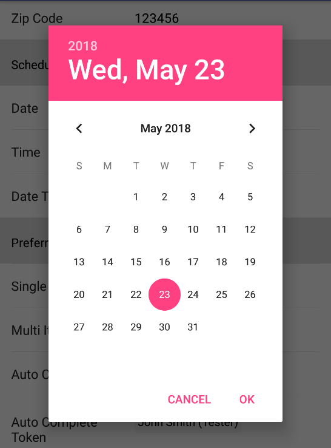
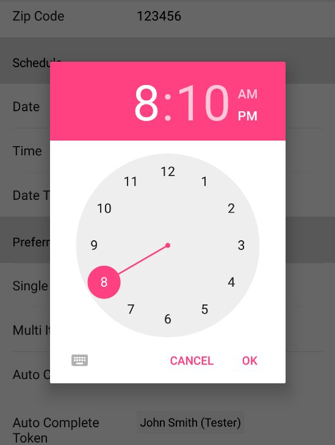

# DateTime

The DateTime form element is used for a date and then time dialog. The date dialog is displayed first and then the time dialog is displayed.






## Theme

Set this override the default alert dialog theme.

```kotlin
dateTime(1) {
    theme = R.style.CustomDialogPicker
}
```

!!! info "Value"

    * You can set value directly by creating a new instance of FormPickerDateTimeElement.DateTimeHolder. However, dateValue and dateFormat will create the instance for you.
    * Call getTime() on value to get a Date object back.

## Date Value

A java.util.Date value.

## Date Format

A java.text.DateFormat value. By default this is SimpleDateFormat.getDateInstance(). It is advised to provide your own format.

## Minimum Date

A java.util.Date value to set the minimum date for the Date picker.

## Maximum Date

A java.util.Date value to set the maximum date for the Date picker.

## Is 24 Hour View

If true, displays the time dialog in the 24 hour view. By default this is false.

## Start Date

A java.util.Date to use if the date value is null. This will set the date and time picker to this date without showing a value on the form.

## Example

### Kotlin

```kotlin
dateTime(1) {
    dateValue = Date()
    dateFormat = SimpleDateFormat("MM/dd/yyyy hh:mm a", Locale.US)
}
```

### Java

```java
List<BaseFormElement<?>> elements = new ArrayList<>();
FormPickerDateTimeElement dateTime = new FormPickerDateTimeElement(1);
dateTime.setDateValue(new Date());
dateTime.setDateFormat(new SimpleDateFormat("MM/dd/yyyy hh:mm a", Locale.US));
elements.add(dateTime);
```
