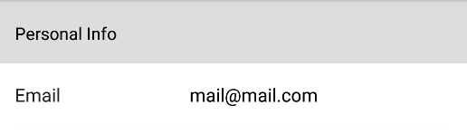

# Header

The Header element is used as a header row.



## Collapsible

By default this is false.
Setting this to true will allow the form header to "collapse/uncollapse" (Hide/Show) elements below it when tapped.

```kotlin
header { collapsible = true }
```

## All Collapsed

By default this is false.
This indicates if elements under the form header are collapsed or not.

```kotlin
header { allCollapsed = true }
```

## Set All Collapsed Later

Use setAllCollapsed(collapse, formBuilder) to collapse/uncollapse elements after initialization.
Collapse or uncollapse all elements under the header until the next header.

```kotlin
// Reverse Collapse
header.setAllCollapsed(!header.allCollapsed, formBuilder)

// Reverse Collapse for all headers
formBuilder.elements.forEach {
    if (it is FormHeader) {
        it.setAllCollapsed(!it.allCollapsed, formBuilder)
    }
}
```

## Example

### Kotlin

```kotlin
header { title = "I'm a header row"; collapsible = true }
```

### Java

```java
List<BaseFormElement<?>> elements = new ArrayList<>();
FormHeader header = new FormHeader("I'm a header row");
elements.add(header);
```
