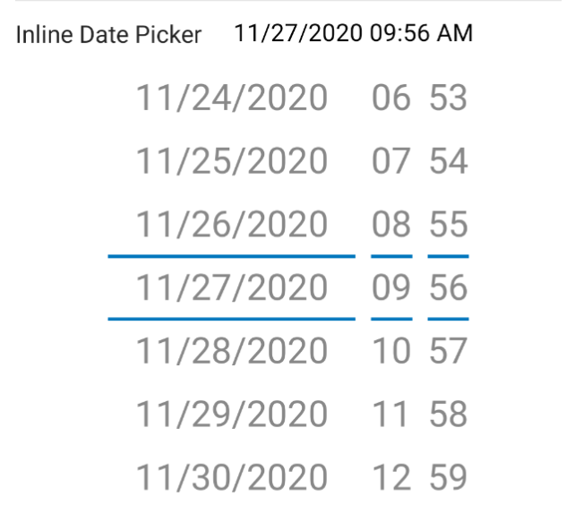

The Inline Date Picker form element is used for an inline date spinner on the form on tap.




!!! info "Value"

    * Value is of type org.threeten.bp.LocalDateTime to keep support for SDK API Level 19.

## LocalDateTime Value

A org.threeten.bp.LocalDateTime value.

## DateTime Format

A org.threeten.bp.format.DateTimeFormatter value. By default this is DateTimeFormatter.ofLocalizedDate(FormatStyle.FULL). It is advised to provide your own format.

## All Day

By default, this is false which shows the time picker.
Set to true to hide the time picker.

## Start Date

Start Date for the picker if value is null.

## Picker Type

By default, this is PickerType.Primary.
Set to PickerType.Secondary for the second Linked Picker.

## Linked Picker

Links two FormInlineDatePickerElements together.

## Example

### Kotlin

```kotlin
inlineDatePicker(1) {
    value = org.threeten.bp.LocalDateTime.now()
    dateTimeFormatter = DateTimeFormatter.ofPattern("MM/dd/yyyy hh:mm a", Locale.US)
    allDay = false
}
```

### Java

```java
List<BaseFormElement<?>> elements = new ArrayList<>();
FormInlineDatePickerElement inlineDatePicker = new FormInlineDatePickerElement(Tag.InlineDatePicker.ordinal());
inlineDatePicker.setValue(org.threeten.bp.LocalDateTime.now());
inlineDatePicker.setDateTimeFormatter(DateTimeFormatter.ofPattern("MM/dd/yyyy hh:mm a", Locale.US));
elements.add(inlineDatePicker);
```
