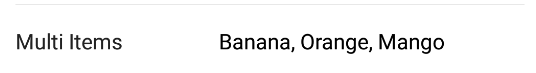
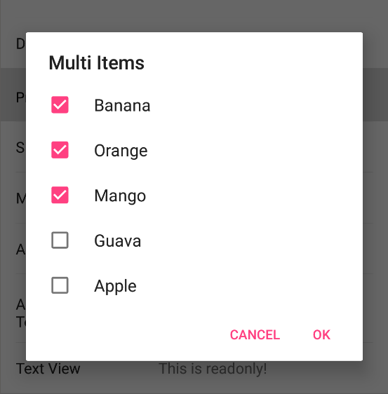

The MultiCheckBox form element is used for a multiple choice dialog.





!!! note "NOTICE"

    The ListItem class is provided in the example app. Your custom class just needs to override toString() to display in the dialog.

## Theme

Set this override the default alert dialog theme.

```kotlin
multiCheckBox<List<ListItem>>(1) {
    theme = R.style.CustomDialogPicker
}
```

## Dialog Title

By default this is "Pick one or more".
Setting this will override the alert dialog title.

```kotlin
multiCheckBox<List<ListItem>>(1) {
    dialogTitle = "Pick one or more"
}
```

## Dialog Empty Message

By default this is "Empty".
Setting this will override the alert dialog message when the options list is empty or null.

```kotlin
multiCheckBox<List<ListItem>>(1) {
    dialogEmptyMessage = "Nothing to see here"
}
```

## Example

### Kotlin

```kotlin
multiCheckBox<List<ListItem>>(1) {
    dialogTitle = "Pick one or more"
    options = listOf(ListItem(id = 1, name = "Banana"),
                     ListItem(id = 2, name = "Orange"))
    value = listOf(ListItem(id = 1, name = "Banana"))
}
```

### Java

```java
List<BaseFormElement<?>> elements = new ArrayList<>();
FormPickerMultiCheckBoxElement<List<ListItem>> multiCheckBox = new FormPickerMultiCheckBoxElement<>(Tag.MultiItems.ordinal());
multiCheckBox.setDialogTitle("Pick one or more");
multiCheckBox.setOptions(Arrays.asList(new ListItem(1L, "Banana"),
    new ListItem(2L, "Orange")));
multiCheckBox.setValue(Collections.singletonList(new ListItem(1L, "Banana")));
elements.add(multiCheckBox);
```
