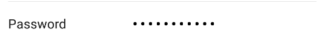

# Password

The Password form element is used for a password value field. This field is masked.



## Example

### Kotlin

```kotlin
password(1) {
    value = "hunter2"
}
```

### Java

```java
List<BaseFormElement<?>> elements = new ArrayList<>();
FormPasswordEditTextElement password = new FormPasswordEditTextElement(1);
password.setValue("hunter2");
elements.add(password);
```
