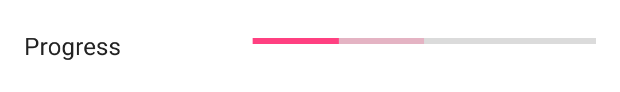

# Progress

The Progress form element is used for a progress bar row.



## Min

Min is the minimum number for the progress bar.

## Max

Max is the maximum number for the progress bar.

## Progress bar style

By default this is ProgressBarStyle.HorizontalBar.
Setting this will change the progress bar style.

```kotlin
progress(1) {
   progressBarStyle = FormProgressElement.ProgressBarStyle.HorizontalBar
}
```

## Intermediate

By default this is false.
Determines if the progress bar should be intermediate.

```kotlin
progress(1) {
   indeterminate = true
}
```

## Progress

The progress value of the progress bar

```kotlin
progress(1) {
   progress = 25
}
```

## Secondary Progress

The secondary progress value of the progress bar

```kotlin
progress(1) {
   secondaryProgress = 50
}
```

## Example

### Kotlin

```kotlin
progress(1) {
    indeterminate = false
    progress = 25
    secondaryProgress = 50
    min = 0
    max = 100
}
```

### Java

```java
List<BaseFormElement<?>> elements = new ArrayList<>();
FormProgressElement progress = new FormProgressElement(1);
progress.setIndeterminate(false);
progress.setProgress(25);
progress.setSecondaryProgress(50);
progress.setMin(50);
progress.setMax(100);
elements.add(progress);
```
