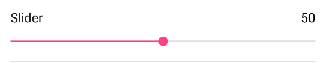

# Slider

The Slider form element is used for a slider (SeekBar) row.



## Min

Min is the minimum number for the slider.

## Max

Max is the maximum number for the slider.

## Steps

Steps are the number of places in the slider. In the example, the slider will step from 0, 5, 10, 15...100.
NOTE: incrementBy must be null. Use steps or incrementBy, not both.

## IncrementBy

Increment by is the number to increase the value by. In the example, the slider will step from 0, 5, 10, 15...100.
NOTE: steps must be null. Use steps or incrementBy, not both.

## Example

### Kotlin

```kotlin
slider(1) {
    value = 50
    min = 0
    max = 100
    steps = 20 // or incrementBy = 5
}
```

### Java

```java
List<BaseFormElement<?>> elements = new ArrayList<>();
FormSliderElement slider = new FormSliderElement(1);
slider.setValue(50);
slider.setMin(0);
slider.setMax(100);
slider.setSteps(20); // or slider.setIncrementBy(5);
elements.add(slider);
```
